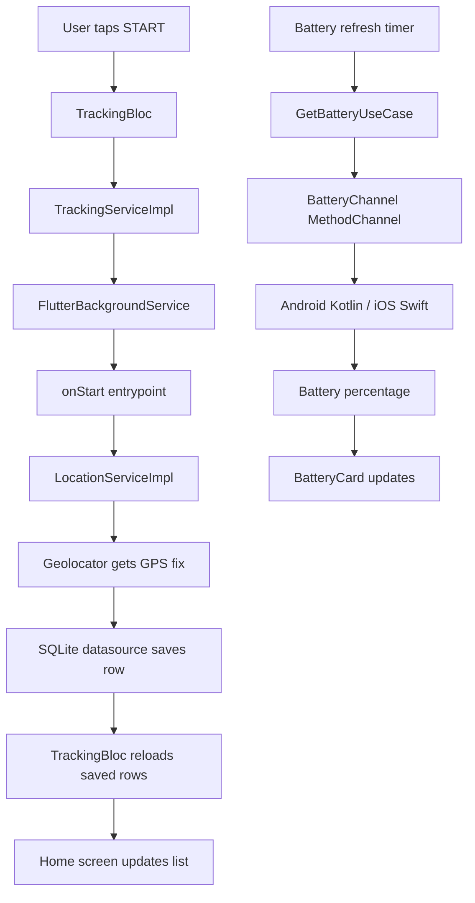

# Background Location Tracker

A Flutter app that:

- Tracks GPS location every 60 seconds
- Saves samples locally
- Shows battery percentage through native platform channels
- Keeps tracking active on Android with a foreground service
- Uses a clean layered architecture

## What This Project Demonstrates

This assessment is mainly about three things:

1. Background location tracking logic
2. Native integration for battery percentage
3. Code structure
The implementation intentionally simple so the flow is easy to understand:

- Flutter UI starts and stops tracking
- A background service handles the Android tracking loop
- Location samples are stored in SQLite
- Battery is fetched from native Android and iOS code through a MethodChannel

## Important Platform Reality

- Android can keep running a foreground service after the app is backgrounded or swiped away.
- iOS can continue location updates in the background, but it does not support the same force-killed behavior as Android.
- If the user force-stops the app on Android from system settings, Android will stop the app until the user opens it again.

## Screen Flow

1. The app opens on the home screen.
2. The UI shows battery, tracking controls, and saved locations.
3. When the user taps `START`, the app requests permission and starts the background service.
4. The service captures a GPS sample every 60 seconds.
5. Each sample is stored locally.
6. The UI reloads the saved rows and shows them in the list.
7. When the user taps `STOP`, the service stops and the session ends.

## Architecture

The app uses a simple layered structure:

- `presentation` for UI and BLoC
- `domain` for entities, services, and use cases
- `data` for database and platform implementations
- `core` for constants, errors, and dependency injection

### High-Level Flow

## Folder Guide

- `lib/main.dart`
  - App bootstrap
  - Initializes dependency injection
  - Configures the background service

- `lib/core/di/di_container.dart`
  - Registers all services, use cases, and bloc instances

- `lib/features/tracking/presentation/pages/home_page.dart`
  - Main UI screen
  - Displays battery, controls, and saved locations

- `lib/features/tracking/presentation/bloc/`
  - Contains event, state, and bloc logic

- `lib/features/tracking/data/services/background_tracking_service.dart`
  - Android foreground service entrypoint
  - Captures location every 60 seconds

- `lib/features/tracking/data/services/location_service_impl.dart`
  - Reads current GPS position using Geolocator

- `lib/features/tracking/data/datasources/location_local_datasource_impl.dart`
  - SQLite read/write implementation

- `lib/core/platform/battery_channel.dart`
  - Flutter side of the native battery MethodChannel

- `android/app/src/main/kotlin/.../MainActivity.kt`
  - Android battery channel implementation

- `ios/Runner/AppDelegate.swift`
  - iOS battery channel implementation

## Data Flow in Detail

### Start Tracking

When `START` is pressed:

1. `TrackingBloc` receives `StartTrackingRequested`
2. `TrackingServiceImpl` checks:
   - GPS service is enabled
   - location permission is available
   - notification permission on Android
3. `FlutterBackgroundService` starts
4. The background service entrypoint begins running
5. The service captures the first GPS sample immediately
6. A 60 second timer starts inside the service

### Save Location

Each GPS sample becomes a `LocationEntity` with:

- latitude
- longitude
- timestamp
- accuracy

Then it is saved through the SQLite datasource.

### Refresh UI

The home screen reloads the saved rows and rebuilds the list.

### Stop Tracking

When `STOP` is pressed:

1. `TrackingBloc` receives `StopTrackingRequested`
2. `TrackingServiceImpl` sends `stopService` to the background service
3. The service cancels its timer
4. The UI stops showing the session as active

## Battery Flow in Detail

The battery percentage is not read from a Flutter package.

Instead, it uses a native `MethodChannel`:

- Flutter calls `background_location_tracker/battery`
- Android returns the battery from `BATTERY_CHANGED`
- iOS returns `UIDevice.current.batteryLevel`

The Flutter side updates the UI every 30 seconds.

## Why SQLite Instead of Hive

I switched to SQLite because:

- The background service and UI can read/write the same database safely
- It is a better fit for structured location records
- It is easier to explain as a simple table of samples

The table stores:

- `latitude`
- `longitude`
- `timestamp`
- `accuracy`

## Native Setup

### Android

Android uses a foreground service so it can keep tracking in the background.

Important permissions in `AndroidManifest.xml`:

- `ACCESS_FINE_LOCATION`
- `ACCESS_COARSE_LOCATION`
- `ACCESS_BACKGROUND_LOCATION`
- `FOREGROUND_SERVICE`
- `FOREGROUND_SERVICE_LOCATION`
- `POST_NOTIFICATIONS`

The service is declared in the manifest and runs with a persistent notification.

The app also checks notification permission before starting tracking, because Android will not allow a foreground service to post its notification otherwise.

### iOS

iOS uses:

- `UIBackgroundModes` with `location`
- `NSLocationWhenInUseUsageDescription`
- `NSLocationAlwaysAndWhenInUseUsageDescription`
- `NSLocationAlwaysUsageDescription`

iOS also has the battery channel in `AppDelegate.swift`.

## Key Classes To Explain

### `TrackingBloc`

This is the main state manager for the screen.

It handles:

- loading saved locations
- starting tracking
- stopping tracking
- refreshing battery
- saving new location rows

### `TrackingServiceImpl`

This service prepares the device for tracking:

- checks location service status
- requests permissions
- starts or stops the background service

### `BackgroundTrackingService`

This is the Android foreground-service logic.

It:

- runs the 60 second timer
- fetches a fresh GPS sample
- stores it in SQLite

### `LocationServiceImpl`

This uses Geolocator to get the current position.

It is intentionally small so it is easy to explain:

- ask Geolocator for one position
- convert that position into a `LocationEntity`
- return it to the service

On Android, the implementation forces the legacy `LocationManager` path instead of the fused location service. I chose that to keep the background flow simpler and avoid extra foreground-notification edge cases on some devices.

### `BatteryChannel`

This wraps the native channel name and handles MethodChannel calls from Flutter.

## How To Run

1. Run `flutter pub get`
2. Run the app on a physical Android device for the full background behavior
3. On iOS Simulator, the battery shows a demo value because simulators do not expose real battery state
4. On a real iPhone, battery and background location behavior are more realistic
